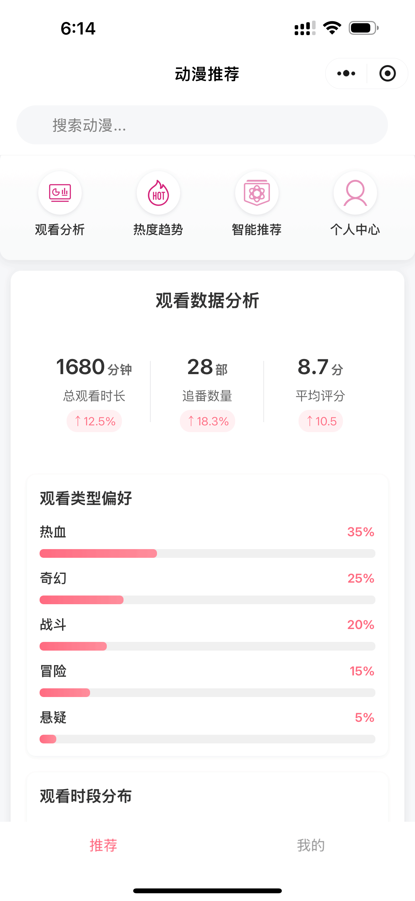
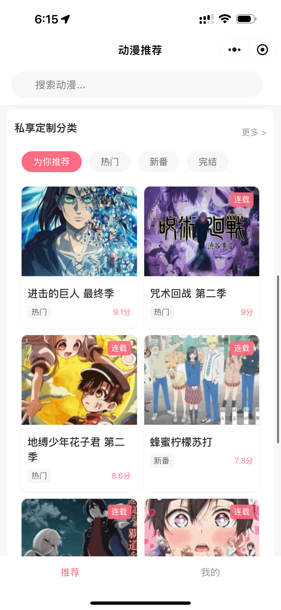

# 🌟 动漫推荐小程序 | Anime Recommender Mini Program

基于微信小程序开发的智能动漫推荐系统，提供个性化动漫内容推荐和数据分析功能。

## ✨ 功能特点

* 📱 现代化UI设计，采用清新简约风格
* 🤖 智能推荐系统
  * 基于用户观看历史的个性化推荐
  * 动态匹配度计算
  * 多维度兴趣分析
* 📊 数据可视化
  * 观看时段分布图表
  * 类型偏好饼图
  * 评分统计分析
* 🏷️ 分类浏览
  * 智能分类系统
  * 热门、新番、完结等多维度分类
  * 标签化管理
* 👤 个人中心
  * 观看历史记录
  * 收藏管理
  * 个性化数据统计
* 🔍 搜索功能
  * 支持动漫名称搜索
  * 标签筛选
  * 智能排序

## 🛠️ 技术栈

* 前端框架
  * 微信小程序原生开发
  * WXML + WXSS + JavaScript
* 数据可视化
  * ECharts 图表库
  * 自定义数据可视化组件
* 项目特性
  * 组件化开发
  * 模块化数据管理
  * 响应式布局设计

## 📦 项目结构

```
anime-recommender-miniapp/
├── pages/                # 页面文件
│   ├── index/           # 首页
│   ├── recommend/       # 智能推荐页
│   ├── profile/         # 个人中心
│   ├── analytics/       # 数据分析页
│   └── trends/          # 热度趋势页
├── components/          # 公共组件
│   ├── ec-canvas/      # ECharts图表组件
│   └── ...
├── utils/              # 工具函数
├── assets/             # 静态资源
└── app.json            # 全局配置
```

## 🚀 快速开始

1. 克隆项目
```bash
git clone https://github.com/MilesSG/anime-recommender-miniapp.git
```

2. 安装依赖
```bash
npm install
```

3. 开发环境配置
- 下载并安装[微信开发者工具](https://developers.weixin.qq.com/miniprogram/dev/devtools/download.html)
- 导入项目，填入自己的AppID
- 开启npm构建

4. 运行项目
- 在微信开发者工具中点击"编译"
- 使用手机微信扫描预览二维码

## 🔄 最近更新

* 2024-02
  * 新增ECharts数据可视化
  * 优化推荐算法
  * 改进UI交互体验

## 🤝 贡献指南

1. Fork 本仓库
2. 创建新的功能分支 (`git checkout -b feature/AmazingFeature`)
3. 提交更改 (`git commit -m 'Add some AmazingFeature'`)
4. 推送到分支 (`git push origin feature/AmazingFeature`)
5. 提交 Pull Request

## 📄 开源协议

本项目采用 MIT 协议开源，详见 [LICENSE](LICENSE) 文件。

## 👨‍💻 关于作者

* GitHub: [@MilesSG](https://github.com/MilesSG)

## 🙏 致谢

* [ECharts](https://echarts.apache.org/zh/index.html) - 优秀的数据可视化库
* 所有为本项目提供建议和帮助的朋友

---

⭐️ 如果您喜欢这个项目，欢迎给一个 star 支持一下！

## 📸 预览截图

### 首页展示



## 🚀 快速开始

1. 解压缩该项目
2. 下载并安装[微信开发者工具](https://developers.weixin.qq.com/miniprogram/dev/devtools/download.html)

3. 在微信开发者工具中创建新项目：
   * 使用本项目的 AppID：`wxaf086ce1fe91346d`
   * 将克隆的代码复制到新建的项目目录中

4. 预览和调试：
   * 在微信开发者工具中点击"预览"按钮
   * 使用手机微信扫描生成的二维码即可在手机上进行预览
   * 任何开发者都可以使用此方式在自己的手机上进行预览和调试

## 📦 项目结构

```
anime-recommender-miniapp/
├── pages/                # 页面文件
│   ├── index/           # 首页
│   ├── analytics/       # 数据分析页
│   ├── trends/          # 热度趋势页
│   ├── recommend/       # 智能推荐页
│   └── detail/          # 详情页
├── components/          # 组件文件
│   └── data-analysis/   # 数据分析组件
├── data/                # 数据文件
└── app.json             # 全局配置
```

## 🔄 最近更新

* 新增数据分析功能
  - 添加观看数据统计卡片
  - 实现观看类型偏好分析
  - 增加时段分布可视化图表
* 优化UI交互体验
  - 添加动画效果
  - 优化布局结构
  - 改进视觉样式

