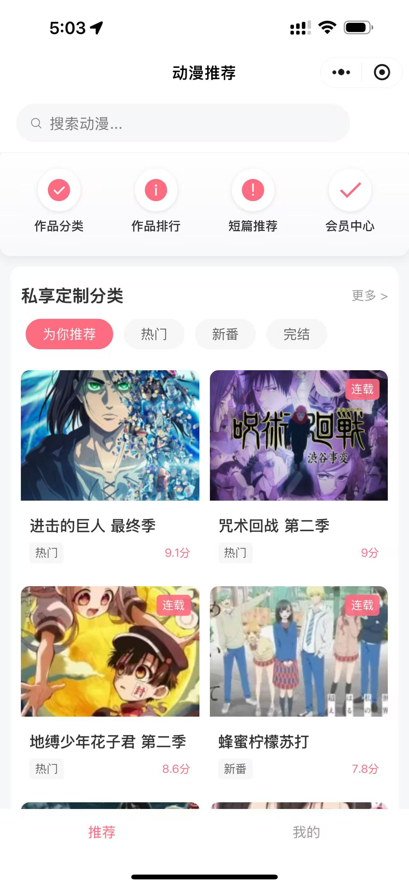

# 🌟 动漫推荐小程序 | Anime Recommender Mini Program

一个基于微信小程序的动漫推荐系统，提供优质动漫内容的展示和推荐。

## ✨ 功能特点

- 📱 现代化UI设计，参考bilibili风格
- 🔍 支持动漫名称搜索
- 🏷️ 智能分类系统（热门、新番、完结等）
- 📊 详细的动漫信息展示
- ⭐ 评分和状态标识
- 🎯 相关动漫推荐

## 🛠️ 技术栈

- 微信小程序原生开发
- WXML + WXSS + JavaScript
- 模块化的数据管理
- 响应式布局设计

## 📸 预览截图



## 🚀 快速开始

1. 克隆项目
```bash
git clone https://github.com/MilesSG/anime-recommender-miniapp.git
```

2. 使用微信开发者工具打开项目

3. 在 project.config.json 中配置您的 AppID

4. 编译运行即可

## 📦 项目结构

```
anime-recommender-miniapp/
├── pages/                # 页面文件
│   ├── index/           # 首页
│   └── detail/          # 详情页
├── data/                # 数据文件
└── app.json             # 全局配置
```

## 🤝 贡献指南

欢迎提交 Issue 和 Pull Request 来帮助改进项目！

## 📄 开源协议

本项目采用 MIT 协议开源，详见 LICENSE 文件。

## 👨‍💻 关于作者

- GitHub: [@MilesSG](https://github.com/MilesSG)

## 🙏 致谢

感谢所有为本项目提供支持和帮助的朋友！

---
⭐️ 如果您喜欢这个项目，欢迎给一个 star 支持一下！ 